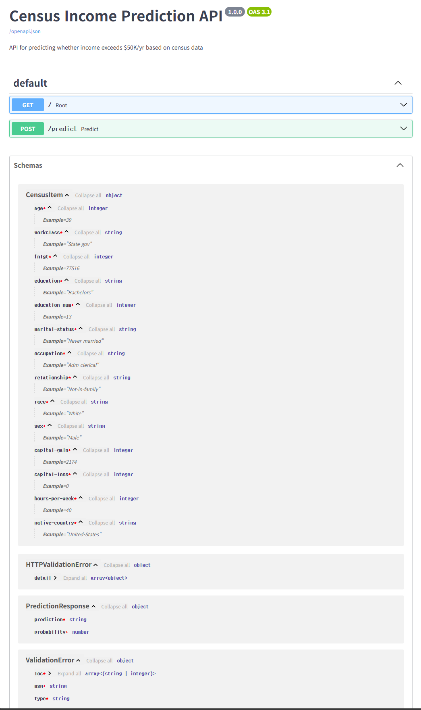
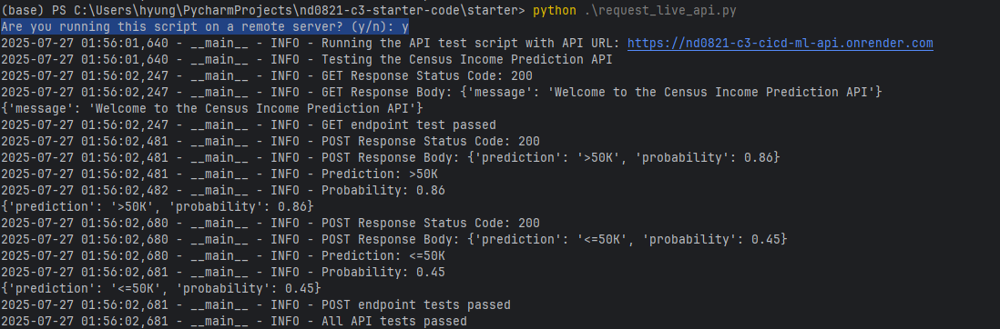
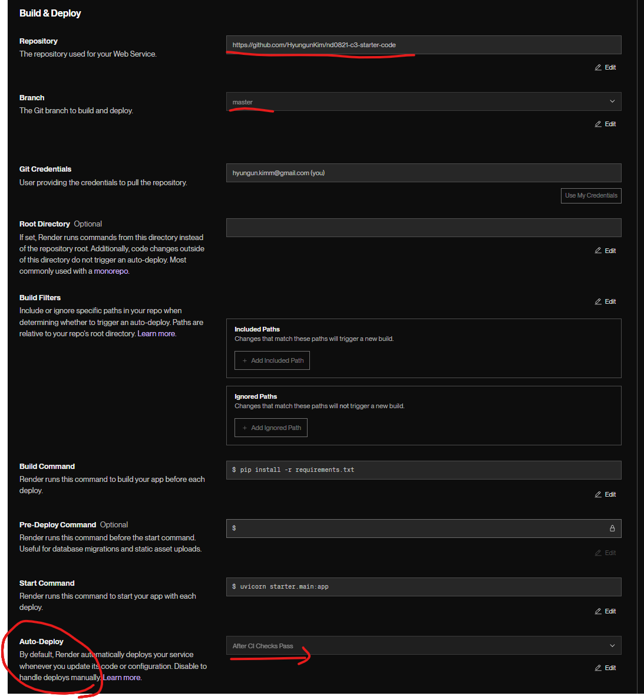
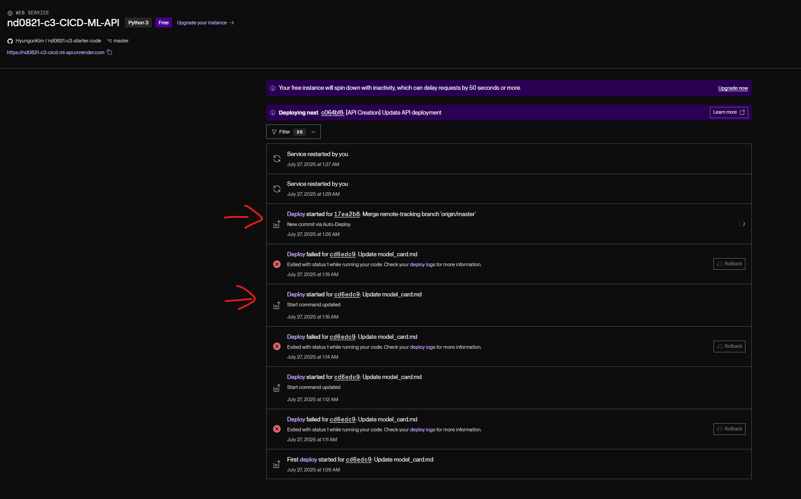
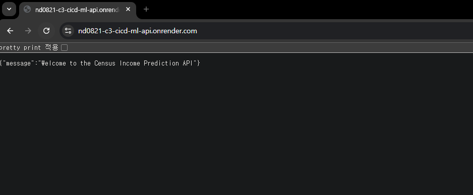

# Census Income Prediction Project - Implementation Details

This document provides details about the implementation of the Census Income Prediction project.

## Project Structure

```
starter/
├── data/                  # Data directory
│   └── census.csv         # Census dataset
├── model/                 # Model directory (created during training)
│   ├── model.pkl          # Trained model
│   ├── encoder.pkl        # One-hot encoder
│   └── lb.pkl             # Label binarizer
├── metrics/               # Metrics directory (created during training)
│   └── slice_metrics.csv  # Performance metrics on data slices
├── ml/                    # Machine learning modules
│   ├── data.py            # Data processing functions
│   └── model.py           # Model training and inference functions
├── tests/                 # Test directory
│   ├── test_data.py       # Tests for data processing
│   ├── test_model.py      # Tests for model functions
│   └── test_api.py        # Tests for API endpoints
├── main.py                # FastAPI application
├── train_model.py         # Script to train and save the model
├── request_live_api.py    # Script to test the live API
└── model_card.md          # Model card documentation
```

## Implementation Details

### Data Processing

The data processing functionality is implemented in `ml/data.py`. The main function is `process_data`, which:
- Separates features and labels
- Handles categorical features using OneHotEncoder
- Processes the label using LabelBinarizer
- Combines continuous and categorical features

### Model Training and Evaluation

The model training and evaluation functionality is implemented in `ml/model.py`. The main functions are:
- `train_model`: Trains a RandomForestClassifier on the provided data
- `inference`: Makes predictions using the trained model
- `compute_model_metrics`: Calculates precision, recall, and F1 score
- `compute_model_metrics_on_slices`: Evaluates model performance on slices of the data

The training pipeline is implemented in `train_model.py`, which:
1. Loads and cleans the census data
2. Splits it into train and test sets
3. Processes the data using the process_data function
4. Trains a model using the train_model function
5. Evaluates the model on the test set
6. Computes and saves metrics on slices of the data
7. Saves the model, encoder, and label binarizer for later use

### API Implementation

The API is implemented in `main.py` using FastAPI. It provides two endpoints:
- GET /: Returns a welcome message
- POST /predict: Takes census data as input and returns a prediction (>50K or <=50K) along with a probability

The API uses Pydantic models for request validation, with type hinting and examples as required. It handles hyphenated column names using aliases in the Pydantic model.

### Testing

Tests are implemented in the `tests` directory:
- `test_data.py`: Tests for the data processing functionality
- `test_model.py`: Tests for the model training and evaluation functionality
- `test_api.py`: Tests for the API endpoints

The tests cover all the required functionality and ensure that the code works as expected.

## Running the Project

### Training the Model

To train the model, run:
```
python train_model.py
```

### Running the API Locally

To run the API locally:
```
uvicorn main:app --reload
```

The API will be available at http://localhost:8000. You can access the interactive documentation at http://localhost:8000/docs.


### Testing

To run all tests:
```bash
pytest tests/
```

To run specific test suites:
- For data processing tests:
  ```bash
  pytest tests/test_data.py
  ```
- For model functions tests:
  ```bash
  pytest tests/test_model.py
  ```
- For API endpoint tests:
  ```bash
  pytest tests/test_api.py
  ```
- For local inference and consistency tests:
  ```bash
  pytest tests/test_inference.py
  ```

To test the live API (after deployment):
```bash
python request_live_api.py
```
Also for the sanity check
```bash
python request_live_api.py
> request_live_api.py
```
## Model Performance

The model achieves the following performance on the test set:
- Precision: ~0.79
- Recall: ~0.58
- FBeta: ~0.67

Performance varies across different demographic slices. Detailed slice metrics are saved in the metrics directory.

## Local Inference with Custom Data

To perform inference on custom data locally (without using the API), you can use the `inference.py` script. This script loads the trained model, encoder, and label binarizer, processes your custom data, and then performs inference.

To run local inference with example data, execute the script:
```bash
python inference.py
```

You can modify the `example_data` DataFrame within `inference.py` to test with your own custom data. Ensure your custom data has the same columns as the training data (excluding the 'salary' column).

## Model Card

See [model_card.md](starter/model_card.md) for detailed information about the model, including its intended use, training data, performance metrics, ethical considerations, and limitations.

## Deployment
Deployment is setup using Render service.  
The service is live at https://nd0821-c3-cicd-ml-api.onrender.com/  
Test the remote api using `request_live_api.py`
```bash
python request_live_api.py
 Are you running this script on a remote server? (y/n): y
```
The result would look like this  

Auto deployment




The api service is publicly up and running
